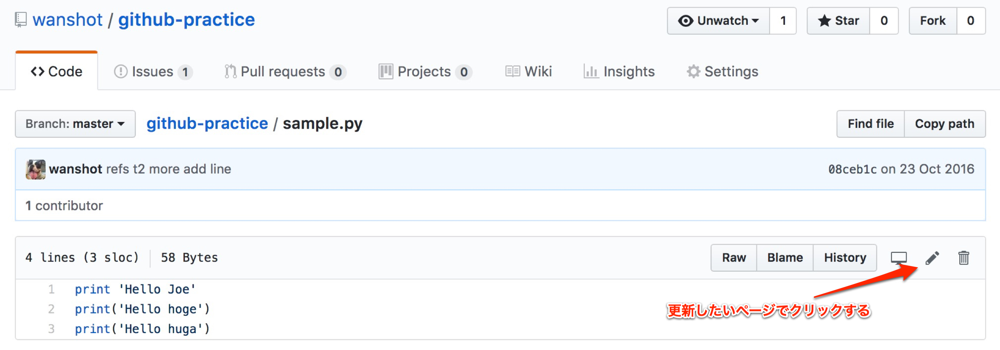

================================
Haro開発ルール
================================

.. contents:: 目次
   :local:

開発
======

開発フロー
-------------

1. 開発したい機能をIssueTemplateに従い記載
2. masterブランチから開発ブランチを作成、開発を行う
3. 開発が終わったら開発ブランチのpushを行う
4. CircleCIがSuccessとなったのを確認し、PullRequestを作成してレビュー依頼を行う
5. LGTMであればmasterブランチに開発ブランチのマージを行う

ブランチ作成
----------------

* 基本的に ``t{issueナンバー}`` という命名規則でブランチを作成してください

ChangeLog.txtについて
--------------------------

* Haroでは変更履歴をPullRequest単位でChangeLog.txtに記載します

以下のテンプレートに従い記載してください

::

   Release Notes - {masterブランチにマージ日}
   -------------------------------------------
   - [PR番号] PR内容

* 例

::

   Release Notes - 2016-12-21
   --------------------------
   - [#4] thxコマンドを追加
   - [#5] kudoコマンドを追加

HELPコマンドの実装
--------------------------

以下のメリットがあるためHaroではHELPコマンドの実装を推奨しています

* コマンドの使い方を忘れた時にSlackで使い方を確認できる
* 開発時のコード自体の説明になる

::

   HELP = """
   - `コマンド名`: コマンドの説明
   """
   from haro.botmessage import botsend

   @respond_to('^hoge\s+help$')
   def show_help_hoge_commands(message):
       """hogeコマンドのhelpを表示
       """
       botsend(message, HELP)

* 例

::

   HELP = """
   - `$redbull count`: RedBullの残り本数を表示する
   - `$redbull num`: numの数だけRedBullの本数を減らす(負数の場合、増やす)
   - `$redbull history`: 自分のRedBullの消費履歴を表示する
   - `$redbull clear`: RedBullのDBデータを削除するtoken付きのコマンドを表示する
   - `$redbull csv`: RedBullの月単位の消費履歴をCSV形式で表示する
   - `$redbull help`: redbullコマンドの使い方を返す
   """

      from haro.botmessage import botsend

      @respond_to('^redbull\s+help$')
      def show_help_redbull_commands(message):
          """RedBullコマンドのhelpを表示
          """
          botsend(message, HELP)

READMEにコマンドの説明を記載
---------------------------------------

コマンド実装時、README.mdにはコマンドの説明を記載します

* 以下のテンプレートに従い記載してください

::

   ### {機能名} plugin

   `{コマンド名}`: {コマンドの説明}

* 例

::

   ### random plugin

   `$random`: チャンネルにいるメンバーからランダムに一人を選ぶ
   `$random active`: チャンネルにいるactiveなメンバーからランダムに一人を選ぶ
   `$random help`: randomコマンドの使い方を返す

実装方針
=============

基本
-------

* 以下のレビューチェックシートに沿って実装する事

::

   C2 体を表す名前の公理：あらかじめ決められている以外の汎用的な名前のモジュールを作らない
   C3 汎用名のモジュール内に長々と具体的処理を書かない
   C4 単純な処理の長さで分割しない
   C5 引数の数を減らす
   C6 パッケージ間で共通した定数を作らない
   C7 継承の利用を最小限にする
   C8 親クラスのテストを子クラスでも実行すること
   C9 オーバーライドを減らす
   C10 継承やオーバーライドを明示する

モジュール設計
--------------------------

* 基本的に ``src/haro/plugins/`` 直下に機能の実装を行ってください。
* コマンドに関連する処理は ``src/haro/plugin/hoge機能.py`` として実装してください
* SQLAlchemyのTable オブジェクトは機能単位で ``src/haro/plugin/hoge機能_models.py`` として実装してください
* ユーティリティ関数などは ``src/haro/`` 直下に実装してください

コーディング規則
--------------------------

* Haro内のPythonコードはシングルクォーテーションで統一してください
* Haro内のPythonコードは一行100文字以内に収めてください
* Haro内で共通して使用する処理は ``src/haro/`` 内に切り出してください
* Haro内で共通して使用する変数は ``src/haro/slackbot_settings.py`` 内に定義してください
  * 環境毎に設定する必要がある変数は環境変数から参照するようにしてください

docstring
--------------------------

* docstring は、Sphinxスタイルで記述する

* 例

::

   def function(arg0, arg1):
       """ 関数の説明

       :param str arg0: arg0の説明
       :param arg1: arg1の説明
       :type arg1: :class:`package.module.Class`
       :return: 返り値の説明
       :rtype: Union[bar_type, None]
       """
       pass

ライブラリの導入について
--------------------------

* ライブラリを導入した場合は ``src/requirements.txt`` に記載してください

その他
-------------

SlackIDからユーザー名を取得する際は以下の関数を使ってください

* ``src/haro/slack.py`` の ``get_user_name()`` 関数
   - SlackのusersAPIのキャッシュからを呼び出しているのでSlackに問い合わせを行いません

ユーザー名からSlackIDを取得する場合、以下の関数を使ってください

* ``src/haro/alias.py`` の ``get_slack_id()`` 関数
   - SlackのusersAPIのキャッシュから呼び出しているのでSlackに問い合わせを行いません
   - 上記の関数を使う事でAlias登録されているユーザー名からもSlackIDを引く事が可能

Slackにメッセージを送信・返信する際は以下の関数を使ってください

* ``src/haro/botmessage.py`` の ``botsend()`` 関数
  - ``message.send()`` の代わりに使用する
  - スレッド内でコマンドを実行したとき、メッセージをスレッド内に送信できます

* ``src/haro/botmessage.py`` の ``botreply()`` 関数
  - ``message.reply()`` の代わりに使用する
  - スレッド内でコマンドを実行したとき、メッセージをスレッド内に返信できます

テスト
========

UnitTestを置く場所
--------------------------

* ``tests/`` 直下に実装してください

UnitTestの実行
--------------------------

* UnitTestの実行はtoxを実行した際に行われます

::

   $ pip install tox
   $ tox

* tox の install はアプリケーションの virtualenv と同じである必要はありません
* ``$ tox`` は ``tox.ini`` と同じディレクトリで実行してください

更新者向け情報
=======================

Githubにサイト上から更新を行う手順
----------------------------------------

* 依頼はRedmineのチケット or Issue登録で行います
   * 【注】外部公開されているので、機密情報が入る時はRedmineのチケットで依頼してください

* 実際のPR作成手順は以下画像を参考ください

| STEP1
|

| STEP2
|

| STEP3
|

| STEP4
|

| STEP5
|

* PRを作成したら、レビューワーにURLを共有します
